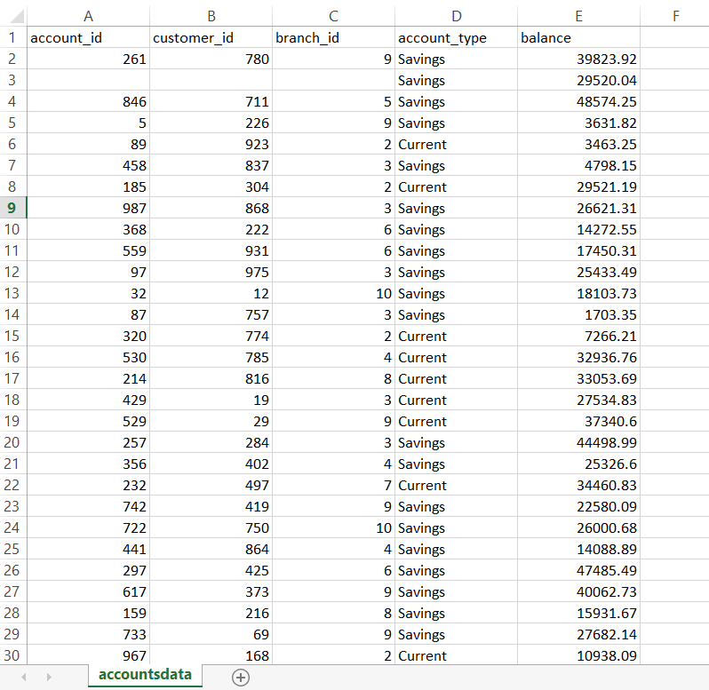
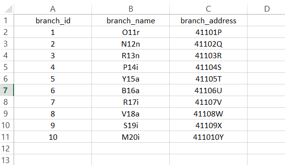
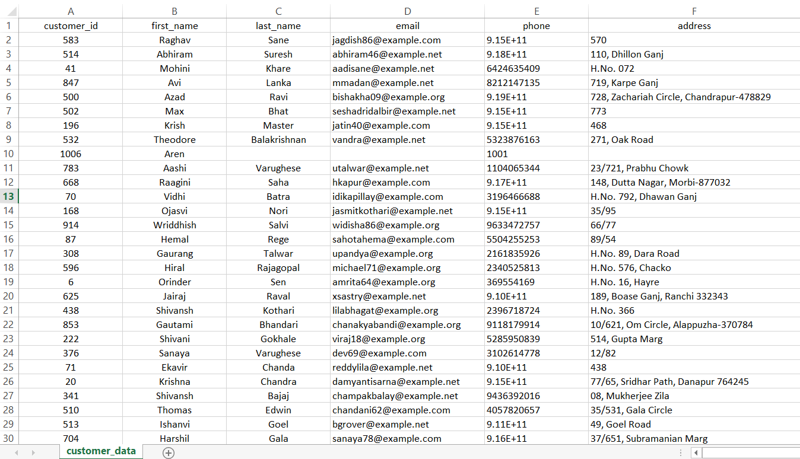
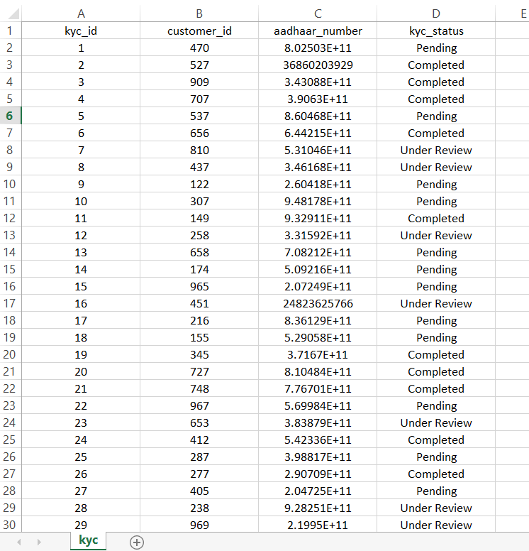
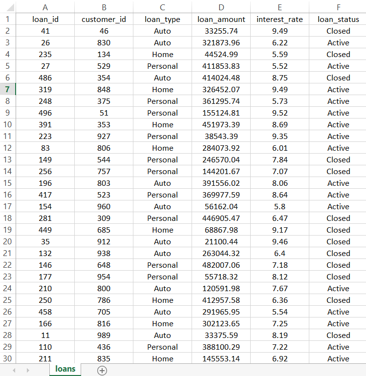
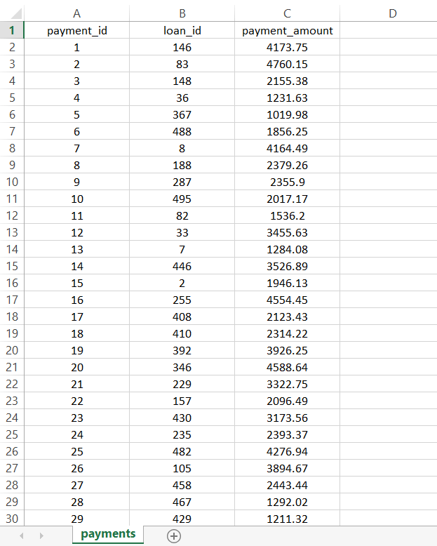
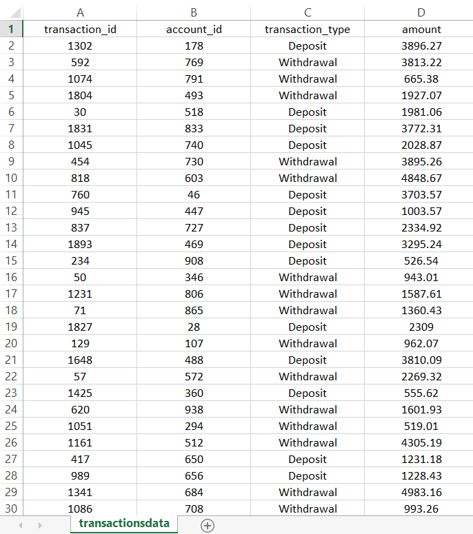

# Banking Data Analysis
### By - Aryan Singh

### Banking Data Analytics Project 2024 

Git-hub repository at: 
https://github.com/httpsaryan/Holistic-Data-Driven-Banking

- Jupyter Notebook: **Banking Project**
- Csv data sets: accountsdata.csv, branches.csv, customer_data.csv, kyc.csv, loans.csv, payments.csv, transactionsdata.csv

# Table of contents
1. [Introduction](#introduction)

2. [Project overview](#section2)
   
   2.1 [Objective](#sec2.1)
   - [Understand Customer Behaviour](#sec2.1.1)
   - [Assess Branch Performance](#sec2.1.2)
   - [Identify Optimization Opportunities](#sec2.1.3)

   2.2 [Data Sources](#sec2.2)

   2.3 [Tools/Libraries](#sec2.3)

3. [Data Understanding](#dataunderstanding)

   3.1 [Data Description](#description)

   3.2 [Data Quality Issues](#quality)

   3.3 [Summary Statistics](#stats)

4. [Data Preparation](#dataprep)

   4.1 [Data Cleaning](#cleaning)

5. [Relationship building](#relations)

6. [Insights](#insights)

7. [Action Steps](#actionsteps)

## 1. Introduction 
- This README describes work on the 7 Datasets of Banking for the Fundamentals of Data Analysis module assessment, which is due 15 December 2024. Resources used include Python and the associated packages Jupyter, numpy, matplotlib, seaborn, and Pandas, which are all part of the Python distribution.
- The analysis takes the form of a single Jupyter notebook of filename given above. To view this file, download it from this repository and start Jupyter notebook in the folder containing the file. Use the command **python -m notebook** on the command line.
- All csv files intended for inclusion in this README are located in the **csv folder** subdirectory of this repository.
- We have tried to structure the Jupyter notebook and this README so that they have corresponding sections. However, we do not wish to merely repeat here what has been stated in the notebook. We will endeavour to have this README summarize the work of the notebook and, hopefully, complement the analyses done there.

## 2. Project Overview 
The primary goal of this analysis is to gain deep insights into the bank's operations and customer behavior by examining seven core data sets. Through comprehensive data analysis and modeling, we aim to:

### 2.1 Objective 

#### 2.1.1 Understand Customer Behaviour 
Gain a comprehensive understanding of customer interactions with the bank, including account activity, loan utilization, and payment habits. 

#### 2.1.2 Assess Branch Performance 
Evaluate the efficiency and effectiveness of individual branches based on key metrics such as customer footfall, transaction volume, and loan disbursals.

#### 2.1.3 Identify Optimization Opportunities 
Discover potential areas for improvement in customer experience, operational efficiency, and revenue generation.

### 2.2 Data Sources 
The dataset for this analysis comprises seven CSV files:
- accountsdata.csv: Contains detailed information about customer accounts, including account numbers, opening dates, account types, and balances.
- branches.csv: Provides information about the bank's branches, such as branch IDs, locations, and contact details.
- customer_data.csv: Stores demographic and contact information of customers, including names, addresses, phone numbers, and email addresses.
- kyc.csv: Contains Know Your Customer (KYC) documents and verification details for each customer.
- loans.csv: Includes loan details, such as loan amounts, interest rates, tenure, and repayment schedules.
- payments.csv: Records payment transactions, including payment dates, amounts, and payment modes.
- transactionsdata.csv: Contains transaction history for all accounts, including transaction dates, amounts, and transaction types.

### 2.3 Tools and Libraries 
The tool that we have used to do this analysis was Python (Jupyter Notebook) with the following libraries:
- Pandas - Used for Data Manipulation and Analysis
  1. Loading and cleaning the CSV datasets.
  2. Handling missing values and outliers.
  3. Transforming and aggregating data.
  4. Merging and joining datasets based on common keys (e.g., customer ID, branch ID).
  5. Calculating summary statistics (mean, median, mode, standard deviation).
  6. Visualizing data distributions using histograms, box plots, and scatter plots.
- Numpy - Used for numerical computations
  1. Performing array operations for efficient data manipulation.
  2. Implementing statistical calculations.
- Matplotlib and Seaborn - Used for Data Visualization to explore data patterns and trends
  1. Line plots to track trends over time (e.g., loan disbursals).
  2. Bar plots to compare categorical data (e.g., branch performance, customer segments).

## 3. Data Understanding 
To delve deep into the bank's operations and customer behavior, we embarked on a comprehensive exploratory data analysis (EDA) of the seven core datasets. This involved meticulously examining each dataset to understand its structure, identify potential data quality issues, and uncover underlying patterns.

### 3.1 Data Description 
1. ### Accounts:
- This dataset provides granular information about customer accounts, including account numbers, opening dates, account types, and balances. By analyzing this data, we can identify trends in account openings, closures, and balance fluctuations.
- It contains 1054 rows and 5 columns.
- Data types of these columns -> account_id, customer_id, branch_id: integer/numbers ; account_type: string/text/object ; balance: float/decimal

  

2. ### Branches:
- This dataset contains details about the bank's branch network, such as branch IDs, locations, and contact information. By studying this data, we can assess the geographical distribution of branches and their potential impact on customer accessibility.
- It contains 10 rows and 3 columns.
- Data types of these columns -> branch_id: integer/numbers ; branch_name, branch_address: string/text/object

3. ### Customer Data:
- This dataset stores customers' demographic and contact information, including names, addresses, phone numbers, and email addresses. Analyzing this data allows us to understand the customer base and identify potential target segments.
- This file contains 1124 rows and 6 columns.
- Data types of these columns -> customer_id, phone: integer/numbers ; first_name, last_name, email, address: string/text/object

4. ### KYC:
- This dataset contains Know Your Customer (KYC) documents and verification details for each customer. By reviewing this data, we can ensure compliance with regulatory requirements and assess the quality of customer onboarding processes.
- This file contains 500 rows and 4 columns.
- Data types of these columns -> kyc_id, customer_id: integer/numbers ; aadhar_number: complex ; kyc_status: string/text/object

5. ### Loans:
- This dataset includes loan details, such as loan amounts, interest rates, tenure, and repayment schedules. Analyzing this data helps us understand the bank's lending portfolio, identify trends in loan disbursals, and assess credit risk.
- This file contains 550 rows and 6 columns.
- Data types of these columns -> loan_id, customer_id: integer/numbers ; loan_type, loan_status: string/text/object ; loan_amount, interest_rate: float/decimal

6. ### Payments:
- This dataset records payment transactions, including payment dates, amounts, and payment modes. By analyzing this data, we can gain insights into customer payment preferences, identify potential payment issues, and optimize payment processes.
- This file contains 2000 rows and 3 columns.
- Data types of these columns -> payment_id, loan_id: integer/numbers ; payment_amount: float/decimal

7. ### Transactions:
- This dataset contains transaction history for all accounts, including transaction dates, amounts, and transaction types. By analyzing this data, we can understand customer spending patterns, identify high-value customers, and detect potential fraudulent activities.
- This file contains 2061 rows and 4 columns.
- Data types of these columns -> transaction_id, account_id: integer/numbers ; transaction_type: string/text/object ; amount: float/decimal

### 3.2 Data Quality Issues 

#### Null and Duplicates Handling: Dealing with missing values

#### 1. Accounts: Null handling

Columns      |  No. of Nulls  |
-------------|----------------|
account_id   |       11       |
customer_id  |       11       |
branch_id    |       11       |
account_type |       0        |
balance      |       0        |

Here I'm dropping all values because filling all those 33 missing values will not make sense in this dataset

Columns after null dropping: 1043 entries
Data columns: 5

Sr  |  Column    |    Non-Null Count 
----|----------|-------------------- 
 0  | account_id  |  1043 non-null | 
 1  | customer_id |  1043 non-null |  
 2  | branch_id   |  1043 non-null | 
 3  | account_type | 1043 non-null | 
 4  | balance   |    1043 non-null | 

#### Duplicates handling

The total duplicated rows in the accounts dataset were 43.

Dropping duplicates:

Sr |  Column    |    Non-Null Count    
---|------------|-------------------  
 0 | account_id  |  1000 non-null  
 1 | customer_id |  1000 non-null   
 2 | branch_id  |   1000 non-null  
 3 | account_type | 1000 non-null   
 4 | balance   |    1000 non-null   

#### 2. Branches:
This dataset just has 10 rows and doesn't have any null missing values or any inconsistencies

#### 3. Customers: Null handling
In this dataset before handling null values and duplicates, I have removed the Phone column, because, in the phase of data understanding, I analyzed Phone column doesn't contribute to any insights or give any valuable information.

Column-wise null values

Dropping all null values of this dataset

Sr |  Column   |    Non-Null Count    
---|-----------|--------------------   
 0 |  customer_id | 1119 non-null   
 1 |  first_name | 1119 non-null   
 2 |  last_name  | 1119 non-null   
 3 |  email    |   1119 non-null   
 4 |  address   |  1119 non-null   

#### Duplicates:

Dropping all duplicates from the Customer dataset

Sr | Column    |    Non-Null Count  
--- | ------   |    --------------  
 0 | customer_id | 1000 non-null  
 1 | first_name  | 1000 non-null    
 2 | last_name  |  1000 non-null   
 3 | email     |   1000 non-null   
 4 | address   |   1000 non-null

#### 4. KYC:
This dataset doesn't have any null, duplicates, or any inconsistencies

#### 5. Loans: Null handling

#### Duplicates:

#### 6. Payments: Null handling
No null values in this dataset

No duplicates in this dataset

#### 7. Transactions: Null handling
No null values in this dataset

#### Duplicates:

Dropping duplicates

### 3.3 Summary Statistics 

#### 1. Accounts

#### 2. Customer

#### 3. KYC

#### 4. Loans

#### 5. Payments

#### 6. Transactions

